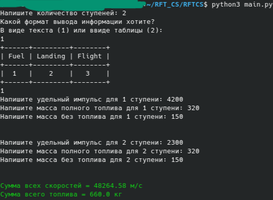

# Численное моделирование топлива ракеты

## Описание
*Численное моделирование топлива ракеты. Производяться расчеты связанные с кольчеством топлива на разных стадиях топлива.*

## Импорты
Импортируется библиотеки numpy и matplotlib, и typing.
Из файла format импортируется функция main_rocket_format, для более удобного вывода результа в консоль

## Константы
- Ускорение свободного падения - 9.81
- Коэффициент массы конструкции для единицы массы топлива - 400

## Функции
- natural_logarithm (Функция нахождения натурального логарифма) - принимает 2 параметра (полную массу рокеты с топливом и без топлива, с типом float), выводит число типа float.
- euler (Функция расчет с помощью Эйлерова числа E) - принимает 2 параметра (Общую скорость и удельный импульс, с типом float), выводит число типа float.
- total_speed (Сумма всех скоростей) - принимает 3 параметра (Удельный импульс, полную массу рокеты с топливом и без топлива, с типом float), выводит число типа float.
- total_oil (Функция для расчета топлива) - принимает 3 параметра (Удельный импульс, общая скорость и массу ракеты без топлива, с типом float), выводит число типа float.
- massa_construction_rocket (Функция расчета массы конструкции ракеты) - принимает 1 параметр (полную массу рокеты с топливом, с типом float), выводит число типа float.

## Пример


## Пример логирования
```bash
2022-12-20 19:34:30 - format.py - root - Запуск класса 'RocketFormat'
2022-12-20 19:34:30 - format.py - root - Запуск класса 'FlightFormat'
2022-12-20 19:34:30 - format.py - root - Запуск класса 'LandingFormat'
2022-12-20 19:34:32 - rocket_flight_simulation.py - root - Включение импортов 'rocket_flight_simulation.py'
2022-12-20 19:34:32 - rocket_flight_simulation.py - root - Запуск класса 'CylindricalCavity'
2022-12-20 19:34:32 - rocket_flight_simulation.py - root - Запуск класса 'Resistance'
2022-12-20 19:34:32 - rocket_flight_simulation.py - root - Запуск класса 'Speed'
2022-12-20 19:34:32 - rocket_flight_simulation.py - root - Запуск класса 'ModelFlight'
2022-12-20 19:34:32 - rocket_fuel_calculation.py - root - Включение импортов 'rocket_fuel_calculation.py'
2022-12-20 19:34:32 - rocket_fuel_calculation.py - root - Запуск класса 'TotalOil'
2022-12-20 19:34:32 - rocket_flight_trajectory.py - root - Запуск класса 'FlightBallistics'
2022-12-20 19:34:32 - main.py - root - Импортирование файлов в main.py
2022-12-20 19:34:32 - main.py - root - Начало функции main
2022-12-20 19:34:33 - main.py - root - Запуск функции output_
2022-12-20 19:34:46 - main.py - root - Включение function_output
2022-12-20 19:34:46 - main.py - root - Включение функции 'fuel_input'
2022-12-20 19:34:58 - main.py - root - Пройден цикл = 1
2022-12-20 19:34:58 - rocket_fuel_calculation.py - root - Запуск функции '_natural_logarithm'
2022-12-20 19:34:58 - rocket_fuel_calculation.py - root - Запуск функции 'total_speed'
2022-12-20 19:34:58 - rocket_fuel_calculation.py - root - Запуск функции '_euler'
2022-12-20 19:34:58 - rocket_fuel_calculation.py - root - Запуск функции 'total_oil'
2022-12-20 19:34:58 - rocket_fuel_calculation.py - root - Запуск функции '_natural_logarithm'
2022-12-20 19:34:58 - rocket_fuel_calculation.py - root - Запуск функции 'total_speed'
2022-12-20 19:34:58 - format.py - root - Запуск функции 'main_rocket_format'
2022-12-20 19:34:58 - format.py - root - Запуск функции 'main_rocket_format'
```
