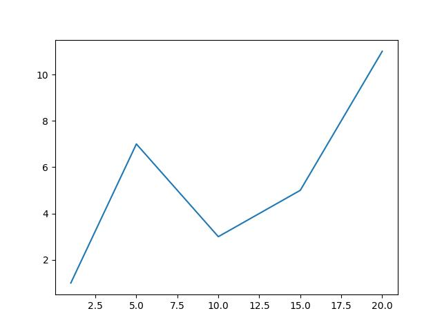
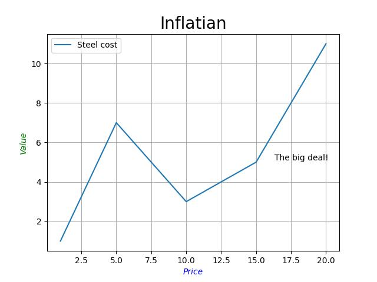
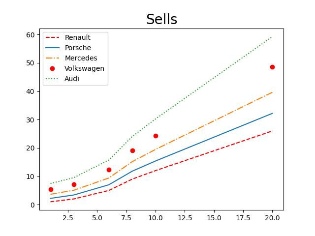

# Линейный график


*Основным элементом изображения, которое строит pyplot является Фигура (Figure), на нее накладываются один или более графиков, осей, надписей и т.п. Для построения графика используется команда plot(). В самом минимальном варианте можно ее использовать без параметров:*
```python
import matplotlib.pyplot as plt
plt.plot()
```

### Пример
*Пример создания графика, по заданным координатам.*
```python
def line_graph():

	# plt.plot([1, 4, 2, 6, 9, 2]) # Только по Y
	# По осям Y и X
	plt.plot([1, 5, 10, 15, 20], [1, 7, 3, 5, 11])
	plt.show()
```
_График:_


### Параметры для графика
- наименование осей;
	- xlabel (или ylabel): str
		- Текст подписи.
	- labelpad: численное значение либо None; значение по умолчанию: None
		- Расстояние между областью графика, включающую оси, и меткой.
- наименование самого графика [plt.title()]
- текстовое примечание на поле с графиком [plt.text()]
- легенда - это название линии

### Пример графика с параметрами
```python
x = [1, 5, 10, 15, 20]
y = [1, 7, 3, 5, 11]
plt.plot(x, y, label='Steel cost')
plt.xlabel(
	'Price',
	fontweight='book',
	fontstyle='italic',
	color='blue',
	fontsize='medium')
plt.ylabel(
	'Value',
	fontweight='book',
	fontstyle='oblique',
	color='green',
	fontsize='medium'
)
plt.title('Inflatian', size='20')
plt.legend()
plt.grid(True)
plt.text(16.3, 5.1, 'The big deal!')
plt.show()
```
_График:_


### Работа с линейным графиком
*\*Настройка графиков других видов, будет осуществляться сходным образом.*

*Стиль линии графика задается через параметр linestyle, который может принимать значения:*
| Значение параметра | Описание |
| --- | ----------- |
| ‘-‘ или ‘solid’ | Непрерывная линия |
| ‘–‘ или ‘dashed’ | Штриховая линия |
| ‘-.’ или ‘dashdot’ | Штрихпунктирная линия |
| ‘:’ или ‘dotted’ | Пунктирная линия |
| ‘None’ или ‘ ‘ или ” | Не отображать линию |

*Стиль линии можно передать сразу после указания списков с координатами без указания, что это параметр linewidth.*
*Для того, чтобы вывести несколько графиков на одном поле необходимо передать соответствующие наборы значений в функцию plot().*

### Пример нескольких линий в одном графике
```python
def sell_cars():
	x = [1, 3, 6, 8, 10, 20]
	y1 = [1, 2, 5, 9, 12, 26]
	plt.plot(x, y1, '--r', label='Renault')
	y2 = [i*1.2 + 1 for i in y1]
	plt.plot(x, y2, '-', label='Porsche')
	y3 = [i*1.2 + 1 for i in y2]
	plt.plot(x, y3, '-.', label='Mercedes')
	y4 = [i*1.2 + 1 for i in y3]
	plt.plot(x, y4, 'ro', label='Volkswagen')
	y5 = [i*1.2 + 1 for i in y4]
	plt.plot(x, y5, ':', label='Audi')

	plt.title('Sells', size=20)
	plt.legend()
	plt.show()
```

_График:_



### Размещение графиков на разных полях
- использование функции subplot() для указания места размещения поля с графиком;
- использование функции subplots() для предварительного задания сетки, в которую будут укладываться поля;
- использование GridSpec, для более гибкого задания геометрии размещения полей с графиками в сетке.

### Sybplot()
_subplot(nrows, ncols, index)_
- nrows: int
	- Количество строк.
- ncols: int
	- Количество столбцов.
- index: int
	- Местоположение элемента.

_subplot(pos)_

- pos:int
	- Позиция, в виде трехзначного числа, содержащего информацию о количестве строк, столбцов и индексе, например 212, означает подготовить разметку с двумя строками и одним столбцов, элемент вывести в первую позицию второй строки. Этот вариант можно использовать, если количество строк и столбцов сетки не более 10, в ином случае лучше обратиться к первому варианту.
